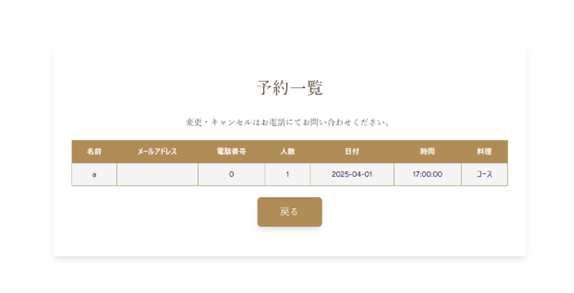

# 予約システム開発

## 1. システム概要（作成背景・サービス概要）
本システムは、お鮨屋さんの予約管理を行うWebアプリケーションです。  
**利用者は一般のお客様と従業員** で、それぞれ以下の目的で使用します。

- **一般のお客様** ：店舗の予約を行う  
- **従業員** ：予約管理（確認・変更・キャンセルなど）を行う  

### **作成背景・実現したい未来**
（2024年12月時点で）お鮨屋さんの予約方法は **直接の次回予約か電話のみ** であり、営業時間中は電話に出られない場合も多く、新規顧客の獲得につながりにくいと感じていました。  
そこで、**予約サイトの導入を検討していただけるように、従業員目線で最もシンプルに使いやすい予約システムを開発** いたしました。  
普段の予約管理と同じ感覚で利用できるカレンダー形式の一覧を導入し、提案することで、**実際の導入検討のきっかけになれば** という思いで作成いたしました。

また、このアプリケーションによって以下の未来を実現したいと考えております。  
- 予約管理の負担を軽減し、業務を効率化する。
- 営業時間外でも予約が可能な仕組みを提供し、新規顧客の獲得につなげる。

## 2. アプリURL
https://reservation-system22-3a8b6a8a08c0.herokuapp.com/

## 3. 主なページと機能
### **一般のお客様用**
- **予約登録** ：基本情報・希望日時・人数・料理（コースかアラカルト）を入力して予約を登録  
- **予約確認** ：自身の予約情報を確認  

### **従業員用**
- **予約登録** ：お客様の予約を代理で登録  
- **予約確認** ：すべての予約を一覧表示（カレンダー形式）  
- **予約編集・削除** ：予約内容を変更、または削除  

## 4. 使用技術
### **バックエンド**
- PHP（Laravel）
- MySQL

### **フロントエンド**
- HTML, CSS, JavaScript

## 5. ER図

## 6. 画面遷移図

## 7. 工夫した点・苦労した点
### **工夫した点**
- **一般の客様用** ：日にちを選択すると、その曜日の営業時間に合わせて時間の選択肢が変わるように工夫しました。  
- **従業員用** ：予約一覧をカレンダー形式で表示し、実際に手書きで管理する感覚に近い仕組みにしました。  

### **苦労した点**
- エラーが解消できずに苦戦しましたが、原因を特定して修正するのに時間を要しました。

